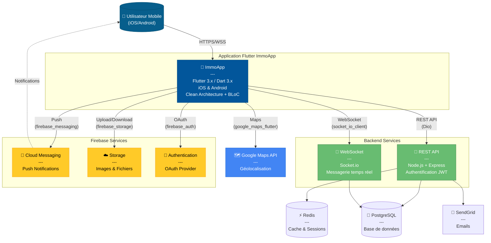

# C4 Model - Niveau 1 : Diagramme de Contexte (Flutter)

## 📌 Vue d'ensemble

Application mobile **cross-platform** développée avec **Flutter/Dart** pour la gestion d'annonces immobilières.

## 🎯 Stack Technique Principal

- **Framework** : Flutter 3.x
- **Langage** : Dart 3.x
- **Plateformes** : iOS & Android
- **Architecture** : Clean Architecture + BLoC

---

## 📊 Diagramme



---

## 📱 Application Flutter

### Caractéristiques Techniques

**Framework** : Flutter 3.16+
- Single codebase pour iOS et Android
- Performance native (compilation AOT)
- Hot reload pour développement rapide
- Widget tree déclaratif

**Packages Flutter Principaux** :
```yaml
flutter_bloc: ^8.1.3        # State management
dio: ^5.4.0                  # HTTP client
hive: ^2.2.3                 # Local database
google_maps_flutter: ^2.5.3  # Maps
socket_io_client: ^2.0.3     # WebSocket
firebase_messaging: ^14.7.9  # Push notifications
image_picker: ^1.0.7         # Camera/Gallery
```

### Fonctionnalités

✅ **Authentification sécurisée**
- Email/Password avec Firebase Auth
- OAuth (Google, Facebook)
- Biométrie (TouchID/FaceID)

✅ **Recherche avancée**
- Filtres multiples (prix, type, localisation)
- Recherche géographique avec rayon
- Sauvegarde des recherches

✅ **Gestion d'annonces**
- Publication avec photos multiples
- Édition/Suppression
- Statistiques de vue

✅ **Messagerie temps réel**
- Chat en direct (WebSocket)
- Notifications push
- Historique persistant

✅ **Carte interactive**
- Google Maps intégré
- Markers cliquables
- Clustering
- Itinéraire vers propriété

✅ **Mode Offline**
- Cache local (Hive)
- Synchronisation automatique
- Favoris accessibles hors ligne

---

## 🔌 Intégrations Flutter

### Firebase Services

**firebase_core** : Initialisation
```dart
await Firebase.initializeApp(
  options: DefaultFirebaseOptions.currentPlatform,
);
```

**firebase_messaging** : Notifications Push
```dart
final messaging = FirebaseMessaging.instance;
await messaging.requestPermission();
FirebaseMessaging.onMessage.listen((message) {
  // Afficher notification
});
```

**firebase_storage** : Upload Images
```dart
final ref = FirebaseStorage.instance.ref('properties/$id');
await ref.putFile(imageFile);
final url = await ref.getDownloadURL();
```

### Google Maps

**google_maps_flutter** : Carte Interactive
```dart
GoogleMap(
  initialCameraPosition: CameraPosition(
    target: LatLng(36.8065, 10.1815),
    zoom: 12,
  ),
  markers: _markers,
  onMapCreated: _onMapCreated,
)
```

**geolocator** : Géolocalisation
```dart
Position position = await Geolocator.getCurrentPosition(
  desiredAccuracy: LocationAccuracy.high,
);
```

### Networking

**Dio** : Client HTTP
```dart
final dio = Dio(BaseOptions(
  baseUrl: 'https://api.immoapp.com',
  connectTimeout: Duration(seconds: 30),
));
dio.interceptors.add(AuthInterceptor());
```

**socket_io_client** : WebSocket
```dart
final socket = io('wss://api.immoapp.com', <String, dynamic>{
  'transports': ['websocket'],
  'auth': {'token': token},
});
socket.on('new_message', (data) {
  // Gérer message
});
```

---

## 🔐 Sécurité Flutter

### Stockage Sécurisé
```dart
final storage = FlutterSecureStorage();
await storage.write(key: 'access_token', value: token);
```

### Certificate Pinning
```dart
dio.httpClientAdapter = IOHttpClientAdapter(
  createHttpClient: () {
    final client = HttpClient();
    client.badCertificateCallback = 
      (X509Certificate cert, String host, int port) {
        return cert.sha256.toString() == expectedSHA256;
      };
    return client;
  },
);
```

### Chiffrement Local (Hive)
```dart
final key = await Hive.generateSecureKey();
final encryptedBox = await Hive.openBox(
  'secure_data',
  encryptionCipher: HiveAesCipher(key),
);
```

---

## 📊 Performance Flutter

### Optimisations

**Images** :
```dart
CachedNetworkImage(
  imageUrl: url,
  memCacheWidth: 800,
  memCacheHeight: 600,
  placeholder: (context, url) => Shimmer(...),
)
```

**Listes** :
```dart
ListView.builder(
  itemCount: items.length,
  cacheExtent: 1000, // Preload
  itemBuilder: (context, index) => ItemWidget(items[index]),
)
```

**Build Optimization** :
```dart
@override
Widget build(BuildContext context) {
  return const PropertyCard(); // const constructor
}
```

---

## 🚀 Déploiement

### iOS (App Store)
```bash
flutter build ios --release
# Ouvrir Xcode et Archive
```

### Android (Google Play)
```bash
flutter build appbundle --release
# Upload sur Play Console
```

### CI/CD avec Codemagic
```yaml
workflows:
  build-deploy:
    environment:
      flutter: 3.16.0
    scripts:
      - flutter test
      - flutter build apk --release
      - flutter build ios --release
```

---

## 🔗 Navigation

- [Niveau 2 : Conteneurs Flutter →](02-container-flutter.md)
- [Niveau 3 : Composants Flutter →](03-component-flutter.md)
- [← Retour Architecture](../README.md)

---

**Technologie** : Flutter 3.x  
**Version** : 1.0  
**Dernière mise à jour** : Décembre 2024