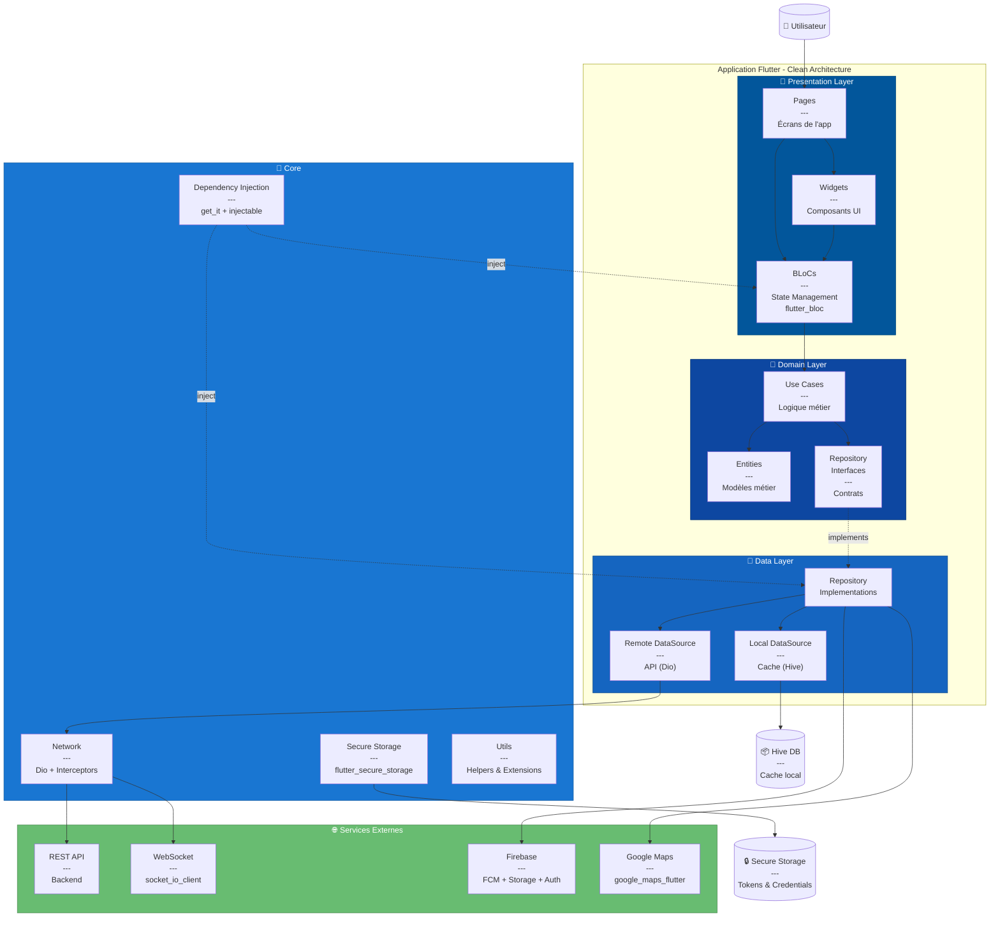

# C4 Model - Niveau 2 : Diagramme de Conteneurs (Flutter)

## 📌 Vue d'ensemble

Architecture détaillée de l'application Flutter avec **Clean Architecture** et **BLoC Pattern**.

---

## 📊 Diagramme



---

## 🎨 Presentation Layer (UI)

### Responsabilité
Interface utilisateur et gestion de l'état avec BLoC.

### Structure
```
lib/features/[feature]/presentation/
├── pages/
│   ├── home_page.dart
│   ├── search_page.dart
│   └── detail_page.dart
├── widgets/
│   ├── property_card.dart
│   └── search_bar.dart
└── bloc/
    ├── property_bloc.dart
    ├── property_event.dart
    └── property_state.dart
```

### Pages Flutter

**MaterialApp avec GoRouter** :
```dart
// lib/app/app.dart
class MyApp extends StatelessWidget {
  const MyApp({super.key});

  @override
  Widget build(BuildContext context) {
    return MaterialApp.router(
      title: 'ImmoApp',
      theme: AppTheme.lightTheme,
      darkTheme: AppTheme.darkTheme,
      routerConfig: AppRouter.router,
    );
  }
}
```

**Exemple de Page** :
```dart
// lib/features/property/presentation/pages/property_list_page.dart
class PropertyListPage extends StatelessWidget {
  const PropertyListPage({super.key});

  @override
  Widget build(BuildContext context) {
    return BlocProvider(
      create: (context) => getIt<PropertyBloc>()
        ..add(const LoadPropertiesEvent()),
      child: Scaffold(
        appBar: AppBar(title: const Text('Annonces')),
        body: BlocBuilder<PropertyBloc, PropertyState>(
          builder: (context, state) {
            return state.when(
              initial: () => const SizedBox(),
              loading: () => const LoadingWidget(),
              loaded: (properties) => PropertyListView(properties),
              error: (message) => ErrorWidget(message),
            );
          },
        ),
      ),
    );
  }
}
```

### Widgets Réutilisables

**PropertyCard** :
```dart
// lib/shared/widgets/property_card.dart
class PropertyCard extends StatelessWidget {
  final Property property;
  
  const PropertyCard({super.key, required this.property});

  @override
  Widget build(BuildContext context) {
    return Card(
      clipBehavior: Clip.antiAlias,
      child: InkWell(
        onTap: () => context.push('/property/${property.id}'),
        child: Column(
          crossAxisAlignment: CrossAxisAlignment.start,
          children: [
            CachedNetworkImage(
              imageUrl: property.imageUrl,
              height: 180,
              width: double.infinity,
              fit: BoxFit.cover,
              placeholder: (context, url) => const ShimmerWidget(),
            ),
            Padding(
              padding: const EdgeInsets.all(12),
              child: Column(
                crossAxisAlignment: CrossAxisAlignment.start,
                children: [
                  Text(
                    property.title,
                    style: Theme.of(context).textTheme.titleMedium,
                    maxLines: 2,
                    overflow: TextOverflow.ellipsis,
                  ),
                  const SizedBox(height: 8),
                  Text(
                    '${property.price.toStringAsFixed(0)} €',
                    style: Theme.of(context).textTheme.headlineSmall?.copyWith(
                      color: Theme.of(context).primaryColor,
                      fontWeight: FontWeight.bold,
                    ),
                  ),
                  const SizedBox(height: 4),
                  Row(
                    children: [
                      const Icon(Icons.location_on, size: 16),
                      const SizedBox(width: 4),
                      Expanded(
                        child: Text(
                          property.location.city,
                          style: Theme.of(context).textTheme.bodySmall,
                          overflow: TextOverflow.ellipsis,
                        ),
                      ),
                    ],
                  ),
                ],
              ),
            ),
          ],
        ),
      ),
    );
  }
}
```

### BLoC (Business Logic Component)

**Property BLoC** :
```dart
// lib/features/property/presentation/bloc/property_bloc.dart
part 'property_event.dart';
part 'property_state.dart';

class PropertyBloc extends Bloc<PropertyEvent, PropertyState> {
  final GetPropertiesUseCase getProperties;
  final SearchPropertiesUseCase searchProperties;
  final AddPropertyUseCase addProperty;

  PropertyBloc({
    required this.getProperties,
    required this.searchProperties,
    required this.addProperty,
  }) : super(const PropertyState.initial()) {
    on<LoadPropertiesEvent>(_onLoadProperties);
    on<SearchPropertiesEvent>(_onSearchProperties);
    on<AddPropertyEvent>(_onAddProperty);
  }

  Future<void> _onLoadProperties(
    LoadPropertiesEvent event,
    Emitter<PropertyState> emit,
  ) async {
    emit(const PropertyState.loading());
    
    final result = await getProperties(NoParams());
    
    result.fold(
      (failure) => emit(PropertyState.error(failure.message)),
      (properties) => emit(PropertyState.loaded(properties)),
    );
  }

  Future<void> _onSearchProperties(
    SearchPropertiesEvent event,
    Emitter<PropertyState> emit,
  ) async {
    emit(const PropertyState.loading());
    
    final result = await searchProperties(event.filters);
    
    result.fold(
      (failure) => emit(PropertyState.error(failure.message)),
      (properties) => emit(PropertyState.loaded(properties)),
    );
  }

  Future<void> _onAddProperty(
    AddPropertyEvent event,
    Emitter<PropertyState> emit,
  ) async {
    emit(const PropertyState.loading());
    
    final result = await addProperty(event.property);
    
    result.fold(
      (failure) => emit(PropertyState.error(failure.message)),
      (_) => emit(const PropertyState.success('Annonce publiée')),
    );
  }
}
```

**Property Events** :
```dart
// property_event.dart
part of 'property_bloc.dart';

@freezed
class PropertyEvent with _$PropertyEvent {
  const factory PropertyEvent.loadProperties() = LoadPropertiesEvent;
  const factory PropertyEvent.searchProperties(SearchFilters filters) = SearchPropertiesEvent;
  const factory PropertyEvent.addProperty(Property property) = AddPropertyEvent;
  const factory PropertyEvent.updateProperty(String id, Property property) = UpdatePropertyEvent;
  const factory PropertyEvent.deleteProperty(String id) = DeletePropertyEvent;
}
```

**Property States** :
```dart
// property_state.dart
part of 'property_bloc.dart';

@freezed
class PropertyState with _$PropertyState {
  const factory PropertyState.initial() = PropertyInitial;
  const factory PropertyState.loading() = PropertyLoading;
  const factory PropertyState.loaded(List<Property> properties) = PropertyLoaded;
  const factory PropertyState.error(String message) = PropertyError;
  const factory PropertyState.success(String message) = PropertySuccess;
}
```

---

## 💼 Domain Layer (Métier)

### Responsabilité
Logique métier pure, indépendante du framework.

### Structure
```
lib/features/[feature]/domain/
├── entities/
│   └── property.dart
├── repositories/
│   └── property_repository.dart
└── usecases/
    ├── get_properties.dart
    ├── search_properties.dart
    └── add_property.dart
```

### Entities

**Property Entity** :
```dart
// lib/features/property/domain/entities/property.dart
import 'package:freezed_annotation/freezed_annotation.dart';

part 'property.freezed.dart';

@freezed
class Property with _$Property {
  const factory Property({
    required String id,
    required String ownerId,
    required String title,
    required String description,
    required PropertyType type,
    required TransactionType transaction,
    required double price,
    required Location location,
    required PropertyDetails details,
    required List<String> imageUrls,
    required PropertyStatus status,
    required DateTime createdAt,
  }) = _Property;
}

@freezed
class Location with _$Location {
  const factory Location({
    required double latitude,
    required double longitude,
    required String address,
    required String city,
    required String country,
  }) = _Location;
}

@freezed
class PropertyDetails with _$PropertyDetails {
  const factory PropertyDetails({
    required int bedrooms,
    required int bathrooms,
    required double area,
    int? floor,
    required bool hasParking,
    required bool hasElevator,
    required List<String> amenities,
  }) = _PropertyDetails;
}

enum PropertyType { apartment, house, land, office }
enum TransactionType { sale, rent }
enum PropertyStatus { available, sold, rented, pending }
```

### Repository Interfaces

```dart
// lib/features/property/domain/repositories/property_repository.dart
import 'package:dartz/dartz.dart';
import '../entities/property.dart';
import '../../../../core/errors/failures.dart';

abstract class PropertyRepository {
  Future<Either<Failure, List<Property>>> getProperties();
  Future<Either<Failure, Property>> getPropertyById(String id);
  Future<Either<Failure, List<Property>>> searchProperties(SearchFilters filters);
  Future<Either<Failure, void>> addProperty(Property property);
  Future<Either<Failure, void>> updateProperty(String id, Property property);
  Future<Either<Failure, void>> deleteProperty(String id);
}
```

### Use Cases

```dart
// lib/features/property/domain/usecases/get_properties.dart
import 'package:dartz/dartz.dart';
import 'package:injectable/injectable.dart';
import '../entities/property.dart';
import '../repositories/property_repository.dart';
import '../../../../core/errors/failures.dart';
import '../../../../core/usecases/usecase.dart';

@lazySingleton
class GetPropertiesUseCase implements UseCase<List<Property>, NoParams> {
  final PropertyRepository repository;

  GetPropertiesUseCase(this.repository);

  @override
  Future<Either<Failure, List<Property>>> call(NoParams params) {
    return repository.getProperties();
  }
}

// Base UseCase
abstract class UseCase<Type, Params> {
  Future<Either<Failure, Type>> call(Params params);
}

class NoParams {}
```

---

## 💾 Data Layer

### Responsabilité
Implémentation des repositories et accès aux données.

### Structure
```
lib/features/[feature]/data/
├── models/
│   └── property_model.dart
├── datasources/
│   ├── property_remote_datasource.dart
│   └── property_local_datasource.dart
└── repositories/
    └── property_repository_impl.dart
```

### Models (DTOs)

```dart
// lib/features/property/data/models/property_model.dart
import 'package:freezed_annotation/freezed_annotation.dart';
import '../../domain/entities/property.dart';

part 'property_model.freezed.dart';
part 'property_model.g.dart';

@freezed
class PropertyModel with _$PropertyModel {
  const PropertyModel._();
  
  const factory PropertyModel({
    required String id,
    @JsonKey(name: 'owner_id') required String ownerId,
    required String title,
    required String description,
    required String type,
    required String transaction,
    required double price,
    required LocationModel location,
    required PropertyDetailsModel details,
    @JsonKey(name: 'image_urls') required List<String> imageUrls,
    required String status,
    @JsonKey(name: 'created_at') required String createdAt,
  }) = _PropertyModel;

  factory PropertyModel.fromJson(Map<String, dynamic> json) =>
      _$PropertyModelFromJson(json);

  // Conversion vers Entity
  Property toEntity() {
    return Property(
      id: id,
      ownerId: ownerId,
      title: title,
      description: description,
      type: PropertyType.values.byName(type),
      transaction: TransactionType.values.byName(transaction),
      price: price,
      location: location.toEntity(),
      details: details.toEntity(),
      imageUrls: imageUrls,
      status: PropertyStatus.values.byName(status),
      createdAt: DateTime.parse(createdAt),
    );
  }

  // Conversion depuis Entity
  factory PropertyModel.fromEntity(Property entity) {
    return PropertyModel(
      id: entity.id,
      ownerId: entity.ownerId,
      title: entity.title,
      description: entity.description,
      type: entity.type.name,
      transaction: entity.transaction.name,
      price: entity.price,
      location: LocationModel.fromEntity(entity.location),
      details: PropertyDetailsModel.fromEntity(entity.details),
      imageUrls: entity.imageUrls,
      status: entity.status.name,
      createdAt: entity.createdAt.toIso8601String(),
    );
  }
}
```

### Remote DataSource

```dart
// lib/features/property/data/datasources/property_remote_datasource.dart
import 'package:injectable/injectable.dart';
import 'package:retrofit/retrofit.dart';
import 'package:dio/dio.dart';
import '../models/property_model.dart';

part 'property_remote_datasource.g.dart';

@lazySingleton
@RestApi()
abstract class PropertyRemoteDataSource {
  @factoryMethod
  factory PropertyRemoteDataSource(Dio dio) = _PropertyRemoteDataSource;

  @GET('/properties')
  Future<List<PropertyModel>> getProperties();

  @GET('/properties/{id}')
  Future<PropertyModel> getPropertyById(@Path('id') String id);

  @POST('/properties/search')
  Future<List<PropertyModel>> searchProperties(
    @Body() Map<String, dynamic> filters,
  );

  @POST('/properties')
  Future<void> addProperty(@Body() PropertyModel property);

  @PUT('/properties/{id}')
  Future<void> updateProperty(
    @Path('id') String id,
    @Body() PropertyModel property,
  );

  @DELETE('/properties/{id}')
  Future<void> deleteProperty(@Path('id') String id);
}
```

### Local DataSource (Hive)

```dart
// lib/features/property/data/datasources/property_local_datasource.dart
import 'package:hive/hive.dart';
import 'package:injectable/injectable.dart';
import '../models/property_model.dart';

@lazySingleton
class PropertyLocalDataSource {
  final Box<PropertyModel> _box;

  PropertyLocalDataSource(@Named('propertyBox') this._box);

  Future<void> cacheProperties(List<PropertyModel> properties) async {
    await _box.clear();
    for (final property in properties) {
      await _box.put(property.id, property);
    }
  }

  List<PropertyModel> getCachedProperties() {
    return _box.values.toList();
  }

  Future<void> cacheProperty(PropertyModel property) async {
    await _box.put(property.id, property);
  }

  PropertyModel? getCachedProperty(String id) {
    return _box.get(id);
  }

  Future<void> clearCache() async {
    await _box.clear();
  }
}
```

### Repository Implementation

```dart
// lib/features/property/data/repositories/property_repository_impl.dart
import 'package:dartz/dartz.dart';
import 'package:injectable/injectable.dart';
import '../../domain/entities/property.dart';
import '../../domain/repositories/property_repository.dart';
import '../../../../core/errors/failures.dart';
import '../../../../core/network/network_info.dart';
import '../datasources/property_remote_datasource.dart';
import '../datasources/property_local_datasource.dart';

@LazySingleton(as: PropertyRepository)
class PropertyRepositoryImpl implements PropertyRepository {
  final PropertyRemoteDataSource remoteDataSource;
  final PropertyLocalDataSource localDataSource;
  final NetworkInfo networkInfo;

  PropertyRepositoryImpl({
    required this.remoteDataSource,
    required this.localDataSource,
    required this.networkInfo,
  });

  @override
  Future<Either<Failure, List<Property>>> getProperties() async {
    if (await networkInfo.isConnected) {
      try {
        final properties = await remoteDataSource.getProperties();
        await localDataSource.cacheProperties(properties);
        return Right(properties.map((model) => model.toEntity()).toList());
      } catch (e) {
        return Left(ServerFailure(e.toString()));
      }
    } else {
      try {
        final cachedProperties = localDataSource.getCachedProperties();
        if (cachedProperties.isEmpty) {
          return const Left(CacheFailure('Aucune donnée en cache'));
        }
        return Right(
          cachedProperties.map((model) => model.toEntity()).toList(),
        );
      } catch (e) {
        return Left(CacheFailure(e.toString()));
      }
    }
  }

  @override
  Future<Either<Failure, Property>> getPropertyById(String id) async {
    if (await networkInfo.isConnected) {
      try {
        final property = await remoteDataSource.getPropertyById(id);
        await localDataSource.cacheProperty(property);
        return Right(property.toEntity());
      } catch (e) {
        return Left(ServerFailure(e.toString()));
      }
    } else {
      final cachedProperty = localDataSource.getCachedProperty(id);
      if (cachedProperty != null) {
        return Right(cachedProperty.toEntity());
      }
      return const Left(CacheFailure('Propriété non trouvée en cache'));
    }
  }

  // ... autres méthodes
}
```

---

## 🔧 Core

### Dependency Injection (get_it + injectable)

```dart
// lib/core/di/injection.dart
import 'package:get_it/get_it.dart';
import 'package:injectable/injectable.dart';
import 'injection.config.dart';

final getIt = GetIt.instance;

@InjectableInit()
Future<void> configureDependencies() async => getIt.init();
```

**Usage dans main.dart** :
```dart
void main() async {
  WidgetsFlutterBinding.ensureInitialized();
  await configureDependencies();
  runApp(const MyApp());
}
```

### Network (Dio)

```dart
// lib/core/network/dio_client.dart
import 'package:dio/dio.dart';
import 'package:injectable/injectable.dart';
import 'package:flutter_dotenv/flutter_dotenv.dart';

@module
abstract class NetworkModule {
  @lazySingleton
  Dio get dio {
    final dio = Dio(
      BaseOptions(
        baseUrl: dotenv.env['API_BASE_URL']!,
        connectTimeout: const Duration(seconds: 30),
        receiveTimeout: const Duration(seconds: 30),
        headers: {
          'Content-Type': 'application/json',
          'Accept': 'application/json',
        },
      ),
    );

    dio.interceptors.addAll([
      AuthInterceptor(),
      LoggerInterceptor(),
      ErrorInterceptor(),
    ]);

    return dio;
  }
}
```

---

## 🔗 Navigation

- [← Niveau 1 : Contexte](01-context-flutter.md)
- [Niveau 3 : Composants →](03-component-flutter.md)

---

**Architecture** : Clean Architecture + BLoC  
**Version** : 1.0