# C4 Model - Niveau 3 : Diagramme de Composants

## 📌 Vue d'ensemble

Ce diagramme détaille l'architecture interne de l'**Application Mobile Flutter**, en décomposant ses composants selon le pattern **Clean Architecture + BLoC** avec **Appwrite** comme backend.

## 🎯 Objectif

Montrer :
- L'organisation interne de l'application mobile Flutter
- Les composants et leurs responsabilités
- L'intégration avec Appwrite (Auth, Database, Storage, Realtime)
- Les patterns architecturaux utilisés

---

## 📊 Diagramme

```mermaid
graph TB
    User[("👤 Utilisateur")]
    
    subgraph PresentationLayer["Couche Présentation"]
        AuthScreens["🔐 Écrans Auth<br/>---<br/>Login, Register<br/>Password Reset"]
        HomeScreen["🏠 Écran Accueil<br/>---<br/>Dashboard<br/>Annonces récentes"]
        SearchScreen["🔍 Écran Recherche<br/>---<br/>Filtres avancés<br/>Résultats"]
        PropertyDetail["📋 Détail Propriété<br/>---<br/>Photos, Info<br/>Localisation"]
        AddProperty["➕ Ajouter Annonce<br/>---<br/>Formulaire<br/>Upload photos"]
        MessagesScreen["💬 Messagerie<br/>---<br/>Liste conversations<br/>Chat"]
        ProfileScreen["👤 Profil<br/>---<br/>Mes annonces<br/>Favoris, Paramètres"]
        MapView["🗺️ Vue Carte<br/>---<br/>Carte interactive<br/>Marqueurs"]
    end
    
    subgraph BusinessLogic["Couche Métier (BLoC/Provider)"]
        AuthBloc["🔐 Auth BLoC<br/>---<br/>Login/Logout<br/>Session management"]
        PropertyBloc["🏠 Property BLoC<br/>---<br/>CRUD Propriétés<br/>Recherche/Filtres"]
        MessageBloc["💬 Message BLoC<br/>---<br/>Envoi/Réception<br/>Conversations"]
        UserBloc["👤 User BLoC<br/>---<br/>Profil<br/>Favoris"]
        NotificationBloc["🔔 Notification BLoC<br/>---<br/>Gestion notifications<br/>Préférences"]
    end
    
    subgraph DataLayer["Couche Données"]
        AuthRepo["🔐 Auth Repository<br/>---<br/>Appwrite Auth<br/>Session storage"]
        PropertyRepo["🏠 Property Repository<br/>---<br/>Appwrite Database<br/>Cache local"]
        MessageRepo["💬 Message Repository<br/>---<br/>Appwrite Realtime<br/>Message persistence"]
        UserRepo["👤 User Repository<br/>---<br/>Appwrite Database<br/>Preferences"]
        LocationService["📍 Location Service<br/>---<br/>GPS<br/>Geocoding"]
        StorageService["💾 Storage Service<br/>---<br/>Hive<br/>Image cache"]
    end
    
    subgraph AppwriteServices["Services Appwrite"]
        AppwriteAuth["🔐 Appwrite Auth<br/>---<br/>Account API<br/>OAuth2"]
        AppwriteDB["🗄️ Appwrite Database<br/>---<br/>Collections<br/>Queries"]
        AppwriteStorage["📦 Appwrite Storage<br/>---<br/>Buckets<br/>File upload"]
        AppwriteRealtime["⚡ Appwrite Realtime<br/>---<br/>WebSocket<br/>Subscriptions"]
        AppwriteFunctions["⚙️ Appwrite Functions<br/>---<br/>Serverless<br/>Background jobs"]
    end
    
    subgraph ExternalServices["Services Externes"]
        MapAPI["🗺️ Maps API<br/>---<br/>Google Maps<br/>Flutter plugin"]
        ImagePicker["📷 Image Picker<br/>---<br/>Camera/Gallery<br/>Plugin"]
        LocalNotifications["🔔 Local Notifications<br/>---<br/>Flutter plugin<br/>Scheduled alerts"]
    end
    
    User --> AuthScreens
    User --> HomeScreen
    User --> SearchScreen
    User --> PropertyDetail
    User --> AddProperty
    User --> MessagesScreen
    User --> ProfileScreen
    User --> MapView
    
    AuthScreens --> AuthBloc
    HomeScreen --> PropertyBloc
    SearchScreen --> PropertyBloc
    PropertyDetail --> PropertyBloc
    PropertyDetail --> MessageBloc
    AddProperty --> PropertyBloc
    MessagesScreen --> MessageBloc
    ProfileScreen --> UserBloc
    ProfileScreen --> PropertyBloc
    MapView --> PropertyBloc
    MapView --> LocationService
    
    AuthBloc --> AuthRepo
    PropertyBloc --> PropertyRepo
    PropertyBloc --> LocationService
    MessageBloc --> MessageRepo
    UserBloc --> UserRepo
    NotificationBloc --> LocalNotifications
    
    AuthRepo --> AppwriteAuth
    PropertyRepo --> AppwriteDB
    PropertyRepo --> AppwriteStorage
    PropertyRepo --> StorageService
    MessageRepo --> AppwriteRealtime
    MessageRepo --> AppwriteDB
    MessageRepo --> StorageService
    UserRepo --> AppwriteDB
    UserRepo --> AppwriteStorage
    LocationService --> MapAPI
    
    AddProperty --> ImagePicker
    PropertyDetail --> AppwriteStorage
    
    AppwriteRealtime -.->|"Real-time updates"| MessageRepo
    AppwriteFunctions -.->|"Background tasks"| AppwriteDB
    
    style AuthScreens fill:#1168bd,stroke:#0b4884,color:#ffffff
    style HomeScreen fill:#1168bd,stroke:#0b4884,color:#ffffff
    style SearchScreen fill:#1168bd,stroke:#0b4884,color:#ffffff
    style PropertyDetail fill:#1168bd,stroke:#0b4884,color:#ffffff
    style AddProperty fill:#1168bd,stroke:#0b4884,color:#ffffff
    style MessagesScreen fill:#1168bd,stroke:#0b4884,color:#ffffff
    style ProfileScreen fill:#1168bd,stroke:#0b4884,color:#ffffff
    style MapView fill:#1168bd,stroke:#0b4884,color:#ffffff
    
    style AuthBloc fill:#438dd5,stroke:#2e6295,color:#ffffff
    style PropertyBloc fill:#438dd5,stroke:#2e6295,color:#ffffff
    style MessageBloc fill:#438dd5,stroke:#2e6295,color:#ffffff
    style UserBloc fill:#438dd5,stroke:#2e6295,color:#ffffff
    style NotificationBloc fill:#438dd5,stroke:#2e6295,color:#ffffff
    
    style AuthRepo fill:#85bbf0,stroke:#5d82a8,color:#000000
    style PropertyRepo fill:#85bbf0,stroke:#5d82a8,color:#000000
    style MessageRepo fill:#85bbf0,stroke:#5d82a8,color:#000000
    style UserRepo fill:#85bbf0,stroke:#5d82a8,color:#000000
    style LocationService fill:#85bbf0,stroke:#5d82a8,color:#000000
    style StorageService fill:#85bbf0,stroke:#5d82a8,color:#000000
    
    style AppwriteAuth fill:#fd366e,stroke:#c02a56,color:#ffffff
    style AppwriteDB fill:#fd366e,stroke:#c02a56,color:#ffffff
    style AppwriteStorage fill:#fd366e,stroke:#c02a56,color:#ffffff
    style AppwriteRealtime fill:#fd366e,stroke:#c02a56,color:#ffffff
    style AppwriteFunctions fill:#fd366e,stroke:#c02a56,color:#ffffff
```



---

## 🎨 Couche Présentation (UI Layer)

### Responsabilités
- Affichage des interfaces utilisateur
- Capture des interactions utilisateur
- Navigation entre écrans
- Animations et transitions

### Principe
- **Aucune logique métier** dans cette couche
- **Widgets purs** réagissant à l'état
- **Communication unidirectionnelle** avec les BLoCs

---

### 🔐 Écrans d'Authentification

**Fichiers :**
```
lib/features/auth/presentation/pages/
├── login_page.dart
├── register_page.dart
├── forgot_password_page.dart
└── verify_email_page.dart
```

**Composants :**
- Formulaires de connexion/inscription
- Validation en temps réel
- Boutons OAuth (Google, Apple, GitHub via Appwrite)
- Gestion des erreurs visuelles

**Navigation :**
```dart
LoginPage → RegisterPage
LoginPage → ForgotPasswordPage
RegisterPage → VerifyEmailPage → HomePage
```

---

### 🏠 Écran d'Accueil

**Fichier :** `lib/features/home/presentation/pages/home_page.dart`

**Composants :**
- Barre de recherche rapide
- Carrousel d'annonces premium
- Liste des annonces récentes (pagination infinie)
- Filtres rapides (prix, type)
- Bottom navigation bar

**Widgets réutilisables :**
```dart
PropertyCard          // Carte annonce avec image cached
SearchBar            // Barre recherche avec suggestions
CategoryChip         // Filtre rapide
PropertyCarousel     // Carrousel avec CachedNetworkImage
```

---

### 🔍 Écran de Recherche

**Fichier :** `lib/features/search/presentation/pages/search_page.dart`

**Composants :**
- Filtres avancés (drawer/modal)
- Liste de résultats avec pagination (Appwrite Queries)
- Switch vue liste/carte
- Tri (prix, date, pertinence)
- Compteur de résultats

**Filtres disponibles :**
```dart
- Type (appartement, maison, terrain)
- Transaction (vente, location)
- Prix (min, max)
- Chambres / Salles de bain
- Surface (m²)
- Localisation + rayon
- Équipements (parking, ascenseur, etc.)
```

---

### 📋 Détail Propriété

**Fichier :** `lib/features/property/presentation/pages/property_detail_page.dart`

**Sections :**
1. **Galerie photos** (swipeable carousel, images depuis Appwrite Storage)
2. **Informations principales** (prix, adresse, surface)
3. **Description** (texte expandable)
4. **Caractéristiques** (icônes + texte)
5. **Localisation** (carte miniature)
6. **Contact vendeur** (bouton message)
7. **Propriétés similaires** (requête Appwrite avec filtres)

**Actions :**
- Ajouter/Retirer des favoris (update document)
- Partager l'annonce
- Contacter le propriétaire
- Voir sur la carte
- Signaler l'annonce

---

### ➕ Ajouter Annonce

**Fichier :** `lib/features/property/presentation/pages/add_property_page.dart`

**Étapes (Stepper) :**
1. **Type et transaction**
2. **Localisation** (saisie + carte)
3. **Détails** (chambres, surface, etc.)
4. **Photos** (upload multiple vers Appwrite Storage)
5. **Prix et description**
6. **Récapitulatif**

**Validation :**
- Champs obligatoires
- Format des données
- Taille/format photos (max 10MB par image)
- Géolocalisation valide

---

### 💬 Messagerie

**Fichiers :**
```
lib/features/messages/presentation/pages/
├── conversations_page.dart
├── chat_page.dart
└── widgets/
    ├── conversation_tile.dart
    ├── message_bubble.dart
    └── chat_input.dart
```

**Fonctionnalités :**
- Liste des conversations (Appwrite Realtime updates)
- Badge notification (non lus)
- Chat temps réel (Appwrite Realtime subscriptions)
- Indicateur "en train d'écrire"
- État lu/non lu
- Support images (Appwrite Storage)
- Recherche dans conversations

---

### 👤 Profil

**Fichier :** `lib/features/profile/presentation/pages/profile_page.dart`

**Sections :**
- **Informations** (photo depuis Appwrite Storage, nom, email)
- **Mes annonces** (actives, vendues, expirées)
- **Favoris** (liste sauvegardée)
- **Recherches sauvegardées**
- **Paramètres**
- **Déconnexion**

**Paramètres :**
- Modifier profil
- Changer mot de passe (Appwrite Auth)
- Préférences notifications
- Langue
- Mode sombre/clair

---

### 🗺️ Vue Carte

**Fichier :** `lib/features/map/presentation/pages/map_view_page.dart`

**Fonctionnalités :**
- Carte interactive Google Maps
- Markers cliquables (propriétés)
- Clustering (nombreuses annonces)
- Recherche par zone visible (Appwrite geo queries)
- Filtre en direct sur carte
- InfoWindow au tap sur marker

**Optimisations :**
- Chargement progressif (viewport)
- Debounce sur déplacements
- Cache des tuiles

---

## ⚡ Couche Métier (Business Logic)

### Architecture BLoC

**Pattern :**
```
Events → BLoC → States → UI
```

**Avantages :**
- Séparation UI/Logique
- Testabilité unitaire
- Réactivité (Streams)
- Gestion d'état prévisible

---

### 🔐 Auth BLoC

**Fichier :** `lib/features/auth/presentation/bloc/auth_bloc.dart`

**Events :**
```dart
abstract class AuthEvent {}

class LoginRequested extends AuthEvent {
  final String email;
  final String password;
}

class RegisterRequested extends AuthEvent {
  final String email;
  final String password;
  final String name;
}

class LoginWithGoogleRequested extends AuthEvent {}

class LogoutRequested extends AuthEvent {}

class AuthStatusChecked extends AuthEvent {}
```

**States :**
```dart
abstract class AuthState {}

class AuthInitial extends AuthState {}
class AuthLoading extends AuthState {}
class Authenticated extends AuthState {
  final User user;
}
class Unauthenticated extends AuthState {}
class AuthError extends AuthState {
  final String message;
}
```

**Responsabilités :**
- Gestion du cycle de vie authentification via Appwrite
- Stockage/récupération session Appwrite
- OAuth2 (Google, Apple, GitHub)
- Vérification email
- Récupération mot de passe

---

### 🏠 Property BLoC

**Fichier :** `lib/features/property/presentation/bloc/property_bloc.dart`

**Events :**
```dart
class LoadProperties extends PropertyEvent {
  final int limit;
  final int offset;
}

class SearchProperties extends PropertyEvent {
  final SearchFilters filters;
}

class LoadPropertyDetail extends PropertyEvent {
  final String id;
}

class AddProperty extends PropertyEvent {
  final PropertyModel property;
  final List<File> images;
}

class UpdateProperty extends PropertyEvent {
  final String id;
  final PropertyModel property;
}

class DeleteProperty extends PropertyEvent {
  final String id;
}

class ToggleFavorite extends PropertyEvent {
  final String propertyId;
}
```

**States :**
```dart
class PropertyInitial extends PropertyState {}

class PropertyLoading extends PropertyState {}

class PropertiesLoaded extends PropertyState {
  final List<Property> properties;
  final bool hasReachedMax;
}

class PropertyDetailLoaded extends PropertyState {
  final Property property;
}

class PropertyError extends PropertyState {
  final String message;
}

class PropertyActionSuccess extends PropertyState {
  final String message;
}
```

---

### 💬 Message BLoC

**Fichier :** `lib/features/messages/presentation/bloc/message_bloc.dart`

**Events :**
```dart
class LoadConversations extends MessageEvent {}

class LoadMessages extends MessageEvent {
  final String conversationId;
}

class SendMessage extends MessageEvent {
  final String conversationId;
  final String content;
  final File? image;
}

class MarkMessageAsRead extends MessageEvent {
  final String messageId;
}

class StartConversation extends MessageEvent {
  final String propertyId;
  final String receiverId;
}

class SubscribeToMessages extends MessageEvent {
  final String conversationId;
}
```

**Appwrite Realtime Integration :**
```dart
class MessageBloc {
  final MessageRepository _repository;
  StreamSubscription? _realtimeSubscription;
  
  MessageBloc(this._repository) {
    on<SubscribeToMessages>((event, emit) async {
      _realtimeSubscription = _repository
          .subscribeToMessages(event.conversationId)
          .listen((message) {
        add(MessageReceived(message));
      });
    });
  }
  
  @override
  Future<void> close() {
    _realtimeSubscription?.cancel();
    return super.close();
  }
}
```

---

### 👤 User BLoC

**Fichier :** `lib/features/user/presentation/bloc/user_bloc.dart`

**Events :**
```dart
class LoadUserProfile extends UserEvent {}

class UpdateUserProfile extends UserEvent {
  final UserModel user;
  final File? avatarImage;
}

class LoadUserProperties extends UserEvent {}

class LoadUserFavorites extends UserEvent {}

class UpdatePreferences extends UserEvent {
  final PreferencesModel preferences;
}
```

---

### 🔔 Notification BLoC

**Fichier :** `lib/core/notifications/bloc/notification_bloc.dart`

**Responsabilités :**
- Affichage notifications locales
- Gestion du badge (compteur)
- Navigation depuis notification
- Synchronisation avec Appwrite Database (notifications stockées)

**Local Notifications :**
```dart
class NotificationBloc {
  final FlutterLocalNotificationsPlugin _localNotifications;
  
  void initialize() {
    const androidSettings = AndroidInitializationSettings('@mipmap/ic_launcher');
    const iosSettings = DarwinInitializationSettings();
    
    _localNotifications.initialize(
      InitializationSettings(android: androidSettings, iOS: iosSettings),
      onDidReceiveNotificationResponse: _onNotificationTapped,
    );
  }
  
  Future<void> showNotification(NotificationModel notification) async {
    await _localNotifications.show(
      notification.id.hashCode,
      notification.title,
      notification.body,
      NotificationDetails(
        android: AndroidNotificationDetails(
          'default_channel',
          'Default Channel',
          importance: Importance.high,
        ),
        iOS: DarwinNotificationDetails(),
      ),
    );
  }
}
```

---

## 💾 Couche Données (Data Layer)

### Responsabilités
- Abstraction des sources de données
- Gestion du cache
- Transformation des données (DTO ↔ Entity)
- Gestion des erreurs
- Communication avec Appwrite

### Pattern Repository

**Principe :**
```dart
abstract class PropertyRepository {
  Future<Either<Failure, List<Property>>> getProperties({
    int limit = 25,
    int offset = 0,
  });
  Future<Either<Failure, Property>> getPropertyById(String id);
  // ...
}

class PropertyRepositoryImpl implements PropertyRepository {
  final AppwriteDatabase database;
  final AppwriteStorage storage;
  final PropertyLocalDataSource localDataSource;
  final NetworkInfo networkInfo;
  
  @override
  Future<Either<Failure, List<Property>>> getProperties({
    int limit = 25,
    int offset = 0,
  }) async {
    if (await networkInfo.isConnected) {
      try {
        final documents = await database.listDocuments(
          databaseId: AppwriteConstants.databaseId,
          collectionId: AppwriteConstants.propertiesCollection,
          queries: [
            Query.limit(limit),
            Query.offset(offset),
            Query.orderDesc('\$createdAt'),
          ],
        );
        
        final properties = documents.documents
            .map((doc) => Property.fromAppwrite(doc))
            .toList();
            
        await localDataSource.cacheProperties(properties);
        return Right(properties);
      } catch (e) {
        return Left(ServerFailure(e.toString()));
      }
    } else {
      try {
        final cachedProperties = await localDataSource.getCachedProperties();
        return Right(cachedProperties);
      } catch (e) {
        return Left(CacheFailure());
      }
    }
  }
}
```

---

### 🔐 Auth Repository

**Fichier :** `lib/features/auth/data/repositories/auth_repository_impl.dart`

**Data Sources :**
- **Appwrite Account API** : Authentification
- **Local** : Hive (user preferences)

**Méthodes :**
```dart
class AuthRepositoryImpl implements AuthRepository {
  final Account account;
  final Client client;
  
  @override
  Future<Either<Failure, User>> login(String email, String password) async {
    try {
      final session = await account.createEmailPasswordSession(
        email: email,
        password: password,
      );
      
      final user = await account.get();
      return Right(User.fromAppwrite(user));
    } on AppwriteException catch (e) {
      return Left(AuthFailure(e.message ?? 'Login failed'));
    }
  }
  
  @override
  Future<Either<Failure, User>> register(RegisterData data) async {
    try {
      await account.create(
        userId: ID.unique(),
        email: data.email,
        password: data.password,
        name: data.name,
      );
      
      // Auto-login après inscription
      return login(data.email, data.password);
    } on AppwriteException catch (e) {
      return Left(AuthFailure(e.message ?? 'Registration failed'));
    }
  }
  
  @override
  Future<Either<Failure, User>> loginWithGoogle() async {
    try {
      await account.createOAuth2Session(
        provider: OAuthProvider.google,
        success: 'https://yourapp.com/auth/success',
        failure: 'https://yourapp.com/auth/failure',
      );
      
      final user = await account.get();
      return Right(User.fromAppwrite(user));
    } on AppwriteException catch (e) {
      return Left(AuthFailure(e.message ?? 'Google login failed'));
    }
  }
  
  @override
  Future<Either<Failure, void>> logout() async {
    try {
      await account.deleteSession(sessionId: 'current');
      return Right(null);
    } on AppwriteException catch (e) {
      return Left(AuthFailure(e.message ?? 'Logout failed'));
    }
  }
  
  @override
  Future<User?> getCurrentUser() async {
    try {
      final user = await account.get();
      return User.fromAppwrite(user);
    } catch (e) {
      return null;
    }
  }
}
```

---

### 🏠 Property Repository

**Fichier :** `lib/features/property/data/repositories/property_repository_impl.dart`

**Appwrite Collections :**
- **properties** : Annonces immobilières
- **property_images** : Références aux images (Storage)
- **favorites** : Favoris utilisateurs

**Stratégie de Cache :**
1. Vérifier cache local (Hive)
2. Si expiré ou inexistant → Appwrite Database
3. Mettre à jour cache
4. Retourner données

**Méthodes avancées :**
```dart
class PropertyRepositoryImpl {
  final Databases databases;
  final Storage storage;
  final PropertyLocalDataSource localDataSource;
  
  @override
  Future<Either<Failure, List<Property>>> searchProperties(
    SearchFilters filters,
  ) async {
    try {
      final queries = _buildQueries(filters);
      
      final documents = await databases.listDocuments(
        databaseId: AppwriteConstants.databaseId,
        collectionId: AppwriteConstants.propertiesCollection,
        queries: queries,
      );
      
      final properties = documents.documents
          .map((doc) => Property.fromAppwrite(doc))
          .toList();
          
      return Right(properties);
    } on AppwriteException catch (e) {
      return Left(ServerFailure(e.message ?? 'Search failed'));
    }
  }
  
  List<String> _buildQueries(SearchFilters filters) {
    final queries = <String>[];
    
    if (filters.type != null) {
      queries.add(Query.equal('type', filters.type));
    }
    
    if (filters.minPrice != null) {
      queries.add(Query.greaterThanEqual('price', filters.minPrice));
    }
    
    if (filters.maxPrice != null) {
      queries.add(Query.lessThanEqual('price', filters.maxPrice));
    }
    
    if (filters.bedrooms != null) {
      queries.add(Query.equal('bedrooms', filters.bedrooms));
    }
    
    // Recherche géographique
    if (filters.latitude != null && filters.longitude != null && filters.radius != null) {
      // Utiliser Appwrite Functions pour recherche géographique complexe
      // ou implémenter filtering côté client pour petits datasets
    }
    
    queries.add(Query.orderDesc('\$createdAt'));
    queries.add(Query.limit(filters.limit ?? 25));
    
    return queries;
  }
  
  @override
  Future<Either<Failure, Property>> addProperty(
    PropertyModel property,
    List<File> images,
  ) async {
    try {
      // 1. Upload images vers Appwrite Storage
      final imageUrls = <String>[];
      for (final image in images) {
        final file = await storage.createFile(
          bucketId: AppwriteConstants.propertyImagesBucket,
          fileId: ID.unique(),
          file: InputFile.fromPath(path: image.path),
        );
        
        imageUrls.add(file.$id);
      }
      
      // 2. Créer document propriété
      final document = await databases.createDocument(
        databaseId: AppwriteConstants.databaseId,
        collectionId: AppwriteConstants.propertiesCollection,
        documentId: ID.unique(),
        data: {
          ...property.toJson(),
          'images': imageUrls,
          'userId': property.userId,
          'status': 'active',
        },
      );
      
      return Right(Property.fromAppwrite(document));
    } on AppwriteException catch (e) {
      return Left(ServerFailure(e.message ?? 'Failed to add property'));
    }
  }
  
  @override
  Future<Either<Failure, void>> toggleFavorite(String propertyId) async {
    try {
      final userId = await _getCurrentUserId();
      
      // Vérifier si déjà en favori
      final existing = await databases.listDocuments(
        databaseId: AppwriteConstants.databaseId,
        collectionId: AppwriteConstants.favoritesCollection,
        queries: [
          Query.equal('userId', userId),
          Query.equal('propertyId', propertyId),
        ],
      );
      
      if (existing.documents.isNotEmpty) {
        // Supprimer favori
        await databases.deleteDocument(
          databaseId: AppwriteConstants.databaseId,
          collectionId: AppwriteConstants.favoritesCollection,
          documentId: existing.documents.first.$id,
        );
      } else {
        // Ajouter favori
        await databases.createDocument(
          databaseId: AppwriteConstants.databaseId,
          collectionId: AppwriteConstants.favoritesCollection,
          documentId: ID.unique(),
          data: {
            'userId': userId,
            'propertyId': propertyId,
            'createdAt': DateTime.now().toIso8601String(),
          },
        );
      }
      
      return Right(null);
    } on AppwriteException catch (e) {
      return Left(ServerFailure(e.message ?? 'Failed to toggle favorite'));
    }
  }
}
```

---

### 💬 Message Repository

**Fichier :** `lib/features/messages/data/repositories/message_repository_impl.dart`

**Appwrite Realtime Integration :**
```dart
class MessageRepositoryImpl implements MessageRepository {
  final Databases databases;
  final Storage storage;
  final Realtime realtime;
  final MessageLocalDataSource localDataSource;
  
  @override
  Stream<Message> subscribeToMessages(String conversationId) {
    final subscription = realtime.subscribe([
      'databases.${AppwriteConstants.databaseId}.collections.${AppwriteConstants.messagesCollection}.documents'
    ]);
    
    return subscription.stream
        .where((event) {
          final payload = event.payload;
          return payload['conversationId'] == conversationId;
        })
        .map((event) => Message.fromAppwrite(event.payload));
  }
  
  @override
  Future<Either<Failure, void>> sendMessage(Message message) async {
    try {
      // Upload image si présente
      String? imageId;
      if (message.imageFile != null) {
        final file = await storage.createFile(
          bucketId: AppwriteConstants.messageImagesBucket,
          fileId: ID.unique(),
          file: InputFile.fromPath(path: message.imageFile!.path),
        );
        imageId = file.$id;
      }
      
      // Créer message dans Appwrite
      await databases.createDocument(
        databaseId: AppwriteConstants.databaseId,
        collectionId: AppwriteConstants.messagesCollection,
        documentId: ID.unique(),
        data: {
          'conversationId': message.conversationId,
          'senderId': message.senderId,
          'content': message.content,
          'imageId': imageId,
          'isRead': false,
          'createdAt': DateTime.now().toIso8601String(),
        },
      );
      
      // Sauvegarder localement (optimistic update)
      await localDataSource.saveMessage(message);
      
      return Right(null);
    } on AppwriteException catch (e) {
      return Left(MessageFailure(e.message ?? 'Failed to send message'));
    }
  }
  
  @override
  Future<Either<Failure, List<Message>>> getMessages(
    String conversationId, {
    int limit = 50,
    int offset = 0,
  }) async {
    try {
      final documents = await databases.listDocuments(
        databaseId: AppwriteConstants.databaseId,
        collectionId: AppwriteConstants.messagesCollection,
        queries: [
          Query.equal('conversationId', conversationId),
          Query.orderDesc('\$createdAt'),
          Query.limit(limit),
          Query.offset(offset),
        ],
      );
      
      final messages = documents.documents
          .map((doc) => Message.fromAppwrite(doc))
          .toList();
          
      return Right(messages);
    } on AppwriteException catch (e) {
      return Left(MessageFailure(e.message ?? 'Failed to load messages'));
    }
  }
  
  @override
  Future<Either<Failure, void>> markAsRead(String messageId) async {
    try {
      await databases.updateDocument(
        databaseId: AppwriteConstants.databaseId,
        collectionId: AppwriteConstants.messagesCollection,
        documentId: messageId,
        data: {'isRead': true},
      );
      
      return Right(null);
    } on AppwriteException catch (e) {
      return Left(MessageFailure(e.message ?? 'Failed to mark as read'));
    }
  }
}
```

---

### 👤 User Repository

**Fichier :** `lib/features/user/data/repositories/user_repository_impl.dart`

**Méthodes :**
```dart
class UserRepositoryImpl implements UserRepository {
  final Databases databases;
  final Storage storage;
  final Account account;
  
  @override
  Future<Either<Failure, UserProfile>> getUserProfile(String userId) async {
    try {
      final document = await databases.getDocument(
        databaseId: AppwriteConstants.databaseId,
        collectionId: AppwriteConstants.usersCollection,
        documentId: userId,
      );
      
      return Right(UserProfile.fromAppwrite(document));
    } on AppwriteException catch (e) {
      return Left(ServerFailure(e.message ?? 'Failed to load profile'));
    }
  }
  
  @override
  Future<Either<Failure, UserProfile>> updateProfile(
    String userId,
    UserUpdateData data,
    File? avatarImage,
  ) async {
    try {
      // Upload avatar si fourni
      String? avatarId;
      if (avatarImage != null) {
        final file = await storage.createFile(
          bucketId: AppwriteConstants.avatarsBucket,
          fileId: ID.unique(),
          file: InputFile.fromPath(path: avatarImage.path),
        );
        avatarId = file.$id;
      }
      
      // Mettre à jour le document
      final document = await databases.updateDocument(
        databaseId: AppwriteConstants.databaseId,
        collectionId: AppwriteConstants.usersCollection,
        documentId: userId,
        data: {
          'name': data.name,
          'phone': data.phone,
          'bio': data.bio,
          if (avatarId != null) 'avatarId': avatarId,
          'updatedAt': DateTime.now().toIso8601String(),
        },
      );
      
      return Right(UserProfile.fromAppwrite(document));
    } on AppwriteException catch (e) {
      return Left(ServerFailure(e.message ?? 'Failed to update profile'));
    }
  }
  
  @override
  Future<Either<Failure, List<Property>>> getUserProperties(String userId) async {
    try {
      final documents = await databases.listDocuments(
        databaseId: AppwriteConstants.databaseId,
        collectionId: AppwriteConstants.propertiesCollection,
        queries: [
          Query.equal('userId', userId),
          Query.orderDesc('\$createdAt'),
        ],
      );
      
      final properties = documents.documents
          .map((doc) => Property.fromAppwrite(doc))
          .toList();
          
      return Right(properties);
    } on AppwriteException catch (e) {
      return Left(ServerFailure(e.message ?? 'Failed to load properties'));
    }
  }
  
  @override
  Future<Either<Failure, List<Property>>> getFavorites(String userId) async {
    try {
      // 1. Récupérer IDs des favoris
      final favoriteDocs = await databases.listDocuments(
        databaseId: AppwriteConstants.databaseId,
        collectionId: AppwriteConstants.favoritesCollection,
        queries: [
          Query.equal('userId', userId),
        ],
      );
      
      final propertyIds = favoriteDocs.documents
          .map((doc) => doc.data['propertyId'] as String)
          .toList();
      
      if (propertyIds.isEmpty) {
        return Right([]);
      }
      
      // 2. Récupérer les propriétés
      final propertyDocs = await databases.listDocuments(
        databaseId: AppwriteConstants.databaseId,
        collectionId: AppwriteConstants.propertiesCollection,
        queries: [
          Query.equal('\$id', propertyIds),
        ],
      );
      
      final properties = propertyDocs.documents
          .map((doc) => Property.fromAppwrite(doc))
          .toList();
          
      return Right(properties);
    } on AppwriteException catch (e) {
      return Left(ServerFailure(e.message ?? 'Failed to load favorites'));
    }
  }
}
```

---

### 📍 Location Service

**Fichier :** `lib/core/services/location_service.dart`

**Dépendances :**
```yaml
dependencies:
  geolocator: ^11.0.0
  geocoding: ^3.0.0
```

**Fonctionnalités :**
```dart
class LocationService {
  // Obtenir position actuelle
  Future<Position> getCurrentPosition() async {
    bool serviceEnabled = await Geolocator.isLocationServiceEnabled();
    if (!serviceEnabled) {
      throw LocationServiceDisabledException();
    }
    
    LocationPermission permission = await Geolocator.checkPermission();
    if (permission == LocationPermission.denied) {
      permission = await Geolocator.requestPermission();
      if (permission == LocationPermission.denied) {
        throw LocationPermissionDeniedException();
      }
    }
    
    return await Geolocator.getCurrentPosition(
      desiredAccuracy: LocationAccuracy.high,
    );
  }
  
  // Convertir coordonnées → adresse
  Future<String> getAddressFromCoordinates(double lat, double lng) async {
    try {
      final placemarks = await placemarkFromCoordinates(lat, lng);
      if (placemarks.isNotEmpty) {
        final place = placemarks.first;
        return '${place.street}, ${place.locality}, ${place.country}';
      }
      return 'Unknown location';
    } catch (e) {
      throw GeocodingException(e.toString());
    }
  }
  
  // Convertir adresse → coordonnées
  Future<LatLng> getCoordinatesFromAddress(String address) async {
    try {
      final locations = await locationFromAddress(address);
      if (locations.isNotEmpty) {
        final location = locations.first;
        return LatLng(location.latitude, location.longitude);
      }
      throw GeocodingException('Address not found');
    } catch (e) {
      throw GeocodingException(e.toString());
    }
  }
  
  // Calculer distance entre 2 points (en km)
  double calculateDistance(LatLng point1, LatLng point2) {
    return Geolocator.distanceBetween(
      point1.latitude,
      point1.longitude,
      point2.latitude,
      point2.longitude,
    ) / 1000; // Convertir en km
  }
  
  // Vérifier si un point est dans un rayon
  bool isWithinRadius(LatLng center, LatLng point, double radiusKm) {
    final distance = calculateDistance(center, point);
    return distance <= radiusKm;
  }
}
```

---

### 💾 Storage Service

**Fichier :** `lib/core/services/storage_service.dart`

**Technologies :**
- **Hive** : Cache local des données
- **Shared Preferences** : Préférences simples

**Dépendances :**
```yaml
dependencies:
  hive: ^2.2.3
  hive_flutter: ^1.1.0
  shared_preferences: ^2.2.2
```

**Usage :**
```dart
class StorageService {
  late Box<PropertyModel> _propertyBox;
  late Box<MessageModel> _messageBox;
  late Box<UserModel> _userBox;
  final SharedPreferences _prefs;
  
  StorageService(this._prefs);
  
  Future<void> initialize() async {
    await Hive.initFlutter();
    
    // Enregistrer les adapters
    Hive.registerAdapter(PropertyModelAdapter());
    Hive.registerAdapter(MessageModelAdapter());
    Hive.registerAdapter(UserModelAdapter());
    
    // Ouvrir les boxes
    _propertyBox = await Hive.openBox<PropertyModel>('properties');
    _messageBox = await Hive.openBox<MessageModel>('messages');
    _userBox = await Hive.openBox<UserModel>('users');
  }
  
  // === Propriétés ===
  Future<void> saveProperty(PropertyModel property) async {
    await _propertyBox.put(property.id, property);
  }
  
  PropertyModel? getProperty(String id) {
    return _propertyBox.get(id);
  }
  
  List<PropertyModel> getAllProperties() {
    return _propertyBox.values.toList();
  }
  
  Future<void> saveProperties(List<PropertyModel> properties) async {
    final map = {for (var p in properties) p.id: p};
    await _propertyBox.putAll(map);
  }
  
  // === Messages ===
  Future<void> saveMessage(MessageModel message) async {
    await _messageBox.put(message.id, message);
  }
  
  List<MessageModel> getConversationMessages(String conversationId) {
    return _messageBox.values
        .where((msg) => msg.conversationId == conversationId)
        .toList();
  }
  
  // === Cache management ===
  Future<void> clearExpiredCache() async {
    final now = DateTime.now();
    final expirationDuration = Duration(days: 7);
    
    // Supprimer les propriétés expirées
    final expiredProperties = _propertyBox.values
        .where((p) => now.difference(p.cachedAt) > expirationDuration)
        .map((p) => p.id)
        .toList();
    
    await _propertyBox.deleteAll(expiredProperties);
  }
  
  Future<void> clearAllCache() async {
    await _propertyBox.clear();
    await _messageBox.clear();
  }
  
  // === Préférences ===
  Future<void> saveUserPreference(String key, dynamic value) async {
    if (value is String) {
      await _prefs.setString(key, value);
    } else if (value is bool) {
      await _prefs.setBool(key, value);
    } else if (value is int) {
      await _prefs.setInt(key, value);
    } else if (value is double) {
      await _prefs.setDouble(key, value);
    }
  }
  
  T? getUserPreference<T>(String key) {
    return _prefs.get(key) as T?;
  }
}
```

---

## 🔌 Services Externes

### 🗺️ Maps API (Google Maps)

**Fichier :** `lib/features/map/widgets/property_map.dart`

**Dépendances :**
```yaml
dependencies:
  google_maps_flutter: ^2.5.0
  google_maps_cluster_manager: ^3.0.0
```

**Implémentation avec Clustering :**
```dart
import 'package:google_maps_flutter/google_maps_flutter.dart';
import 'package:google_maps_cluster_manager/google_maps_cluster_manager.dart';

class PropertyMap extends StatefulWidget {
  final List<Property> properties;
  
  @override
  _PropertyMapState createState() => _PropertyMapState();
}

class _PropertyMapState extends State<PropertyMap> {
  late ClusterManager _clusterManager;
  GoogleMapController? _mapController;
  Set<Marker> _markers = {};
  
  @override
  void initState() {
    super.initState();
    _initClusterManager();
  }
  
  void _initClusterManager() {
    _clusterManager = ClusterManager<PropertyClusterItem>(
      widget.properties.map((p) => PropertyClusterItem(p)).toList(),
      _updateMarkers,
      markerBuilder: _markerBuilder,
    );
  }
  
  void _updateMarkers(Set<Marker> markers) {
    setState(() {
      _markers = markers;
    });
  }
  
  Future<Marker> _markerBuilder(Cluster<PropertyClusterItem> cluster) async {
    return Marker(
      markerId: MarkerId(cluster.getId()),
      position: cluster.location,
      icon: await _getClusterIcon(cluster),
      onTap: () => _onClusterTapped(cluster),
    );
  }
  
  Future<BitmapDescriptor> _getClusterIcon(
    Cluster<PropertyClusterItem> cluster,
  ) async {
    if (cluster.isMultiple) {
      // Icône cluster avec nombre
      return await _createClusterIcon(cluster.count);
    } else {
      // Icône propriété unique
      return BitmapDescriptor.defaultMarkerWithHue(BitmapDescriptor.hueRed);
    }
  }
  
  void _onClusterTapped(Cluster<PropertyClusterItem> cluster) {
    if (cluster.isMultiple) {
      // Zoomer sur le cluster
      _mapController?.animateCamera(
        CameraUpdate.newLatLngZoom(cluster.location, 15),
      );
    } else {
      // Ouvrir détail propriété
      final property = cluster.items.first.property;
      Navigator.pushNamed(
        context,
        '/property-detail',
        arguments: property.id,
      );
    }
  }
  
  @override
  Widget build(BuildContext context) {
    return GoogleMap(
      onMapCreated: (controller) {
        _mapController = controller;
        _clusterManager.setMapId(controller.mapId);
      },
      markers: _markers,
      onCameraMove: _clusterManager.onCameraMove,
      onCameraIdle: _clusterManager.updateMap,
      initialCameraPosition: CameraPosition(
        target: LatLng(36.8065, 10.1815), // Tunis
        zoom: 12,
      ),
      myLocationEnabled: true,
      myLocationButtonEnabled: true,
      zoomControlsEnabled: false,
      mapToolbarEnabled: false,
    );
  }
}

class PropertyClusterItem with ClusterItem {
  final Property property;
  
  PropertyClusterItem(this.property);
  
  @override
  LatLng get location => LatLng(property.latitude, property.longitude);
  
  @override
  String get geohash => Geohash.encode(location, precision: 9);
}
```

---

### 📷 Image Picker Service

**Fichier :** `lib/core/services/image_picker_service.dart`

**Dépendances :**
```yaml
dependencies:
  image_picker: ^1.0.4
  image_cropper: ^5.0.0
```

**Usage avec compression :**
```dart
import 'package:image_picker/image_picker.dart';
import 'package:image_cropper/image_cropper.dart';
import 'package:flutter_image_compress/flutter_image_compress.dart';

class ImagePickerService {
  final ImagePicker _picker = ImagePicker();
  
  Future<File?> pickImageFromGallery({bool crop = false}) async {
    final XFile? image = await _picker.pickImage(
      source: ImageSource.gallery,
      maxWidth: 1920,
      maxHeight: 1080,
      imageQuality: 85,
    );
    
    if (image == null) return null;
    
    File imageFile = File(image.path);
    
    if (crop) {
      imageFile = await _cropImage(imageFile) ?? imageFile;
    }
    
    return await _compressImage(imageFile);
  }
  
  Future<File?> pickImageFromCamera({bool crop = false}) async {
    final XFile? image = await _picker.pickImage(
      source: ImageSource.camera,
      maxWidth: 1920,
      maxHeight: 1080,
      imageQuality: 85,
    );
    
    if (image == null) return null;
    
    File imageFile = File(image.path);
    
    if (crop) {
      imageFile = await _cropImage(imageFile) ?? imageFile;
    }
    
    return await _compressImage(imageFile);
  }
  
  Future<List<File>> pickMultipleImages({int maxImages = 10}) async {
    final List<XFile> images = await _picker.pickMultiImage(
      maxWidth: 1920,
      maxHeight: 1080,
      imageQuality: 85,
    );
    
    if (images.length > maxImages) {
      throw Exception('Maximum $maxImages images allowed');
    }
    
    final compressedImages = <File>[];
    for (final image in images) {
      final compressed = await _compressImage(File(image.path));
      if (compressed != null) {
        compressedImages.add(compressed);
      }
    }
    
    return compressedImages;
  }
  
  Future<File?> _cropImage(File imageFile) async {
    final croppedFile = await ImageCropper().cropImage(
      sourcePath: imageFile.path,
      aspectRatioPresets: [
        CropAspectRatioPreset.square,
        CropAspectRatioPreset.ratio3x2,
        CropAspectRatioPreset.ratio4x3,
        CropAspectRatioPreset.ratio16x9,
      ],
      uiSettings: [
        AndroidUiSettings(
          toolbarTitle: 'Recadrer l\'image',
          toolbarColor: Colors.blue,
          toolbarWidgetColor: Colors.white,
          initAspectRatio: CropAspectRatioPreset.original,
          lockAspectRatio: false,
        ),
        IOSUiSettings(
          title: 'Recadrer l\'image',
        ),
      ],
    );
    
    return croppedFile != null ? File(croppedFile.path) : null;
  }
  
  Future<File?> _compressImage(File file) async {
    final targetPath = file.path.replaceAll('.jpg', '_compressed.jpg');
    
    final result = await FlutterImageCompress.compressAndGetFile(
      file.absolute.path,
      targetPath,
      quality: 85,
      minWidth: 1920,
      minHeight: 1080,
    );
    
    return result != null ? File(result.path) : null;
  }
}
```

---

## 🔧 Configuration Appwrite

### Configuration Client

**Fichier :** `lib/core/config/appwrite_config.dart`

```dart
class AppwriteConfig {
  static const String endpoint = 'https://cloud.appwrite.io/v1';
  static const String projectId = 'YOUR_PROJECT_ID';
  
  // Database
  static const String databaseId = 'immo_db';
  
  // Collections
  static const String propertiesCollection = 'properties';
  static const String usersCollection = 'users';
  static const String messagesCollection = 'messages';
  static const String conversationsCollection = 'conversations';
  static const String favoritesCollection = 'favorites';
  static const String notificationsCollection = 'notifications';
  
  // Storage Buckets
  static const String propertyImagesBucket = 'property_images';
  static const String messageImagesBucket = 'message_images';
  static const String avatarsBucket = 'avatars';
}
```

### Initialisation Client

**Fichier :** `lib/core/di/injection_container.dart`

```dart
import 'package:appwrite/appwrite.dart';
import 'package:get_it/get_it.dart';

final sl = GetIt.instance;

Future<void> initializeDependencies() async {
  // Appwrite Client
  final client = Client()
      .setEndpoint(AppwriteConfig.endpoint)
      .setProject(AppwriteConfig.projectId)
      .setSelfSigned(status: true); // Dev only
  
  sl.registerLazySingleton(() => client);
  
  // Appwrite Services
  sl.registerLazySingleton(() => Account(sl()));
  sl.registerLazySingleton(() => Databases(sl()));
  sl.registerLazySingleton(() => Storage(sl()));
  sl.registerLazySingleton(() => Realtime(sl()));
  sl.registerLazySingleton(() => Functions(sl()));
  
  // Repositories
  sl.registerLazySingleton<AuthRepository>(
    () => AuthRepositoryImpl(sl(), sl()),
  );
  
  sl.registerLazySingleton<PropertyRepository>(
    () => PropertyRepositoryImpl(sl(), sl(), sl(), sl()),
  );
  
  sl.registerLazySingleton<MessageRepository>(
    () => MessageRepositoryImpl(sl(), sl(), sl(), sl()),
  );
  
  sl.registerLazySingleton<UserRepository>(
    () => UserRepositoryImpl(sl(), sl(), sl()),
  );
  
  // BLoCs
  sl.registerFactory(() => AuthBloc(sl()));
  sl.registerFactory(() => PropertyBloc(sl()));
  sl.registerFactory(() => MessageBloc(sl()));
  sl.registerFactory(() => UserBloc(sl()));
  
  // Services
  final prefs = await SharedPreferences.getInstance();
  sl.registerLazySingleton(() => prefs);
  
  final storageService = StorageService(sl());
  await storageService.initialize();
  sl.registerLazySingleton(() => storageService);
  
  sl.registerLazySingleton(() => LocationService());
  sl.registerLazySingleton(() => ImagePickerService());
}
```

---

## 📦 Structure des Modèles

### Property Model

```dart
class Property {
  final String id;
  final String userId;
  final String title;
  final String description;
  final PropertyType type;
  final TransactionType transactionType;
  final double price;
  final double surface;
  final int bedrooms;
  final int bathrooms;
  final double latitude;
  final double longitude;
  final String address;
  final List<String> imageIds;
  final List<String> amenities;
  final PropertyStatus status;
  final DateTime createdAt;
  final DateTime? updatedAt;
  
  Property({
    required this.id,
    required this.userId,
    required this.title,
    required this.description,
    required this.type,
    required this.transactionType,
    required this.price,
    required this.surface,
    required this.bedrooms,
    required this.bathrooms,
    required this.latitude,
    required this.longitude,
    required this.address,
    required this.imageIds,
    required this.amenities,
    required this.status,
    required this.createdAt,
    this.updatedAt,
  });
  
  factory Property.fromAppwrite(Document doc) {
    return Property(
      id: doc.$id,
      userId: doc.data['userId'],
      title: doc.data['title'],
      description: doc.data['description'],
      type: PropertyType.values.byName(doc.data['type']),
      transactionType: TransactionType.values.byName(doc.data['transactionType']),
      price: (doc.data['price'] as num).toDouble(),
      surface: (doc.data['surface'] as num).toDouble(),
      bedrooms: doc.data['bedrooms'],
      bathrooms: doc.data['bathrooms'],
      latitude: (doc.data['latitude'] as num).toDouble(),
      longitude: (doc.data['longitude'] as num).toDouble(),
      address: doc.data['address'],
      imageIds: List<String>.from(doc.data['imageIds'] ?? []),
      amenities: List<String>.from(doc.data['amenities'] ?? []),
      status: PropertyStatus.values.byName(doc.data['status']),
      createdAt: DateTime.parse(doc.$createdAt),
      updatedAt: doc.$updatedAt != null ? DateTime.parse(doc.$updatedAt!) : null,
    );
  }
  
  Map<String, dynamic> toJson() {
    return {
      'userId': userId,
      'title': title,
      'description': description,
      'type': type.name,
      'transactionType': transactionType.name,
      'price': price,
      'surface': surface,
      'bedrooms': bedrooms,
      'bathrooms': bathrooms,
      'latitude': latitude,
      'longitude': longitude,
      'address': address,
      'imageIds': imageIds,
      'amenities': amenities,
      'status': status.name,
    };
  }
}

enum PropertyType { apartment, house, land, commercial, office }
enum TransactionType { sale, rent }
enum PropertyStatus { active, sold, rented, expired }
```

---

## 🔗 Navigation

- [← Niveau 2 : Conteneurs](02-container.md)
- [← Niveau 1 : Contexte](01-context.md)
- [← Retour Architecture](../README.md)